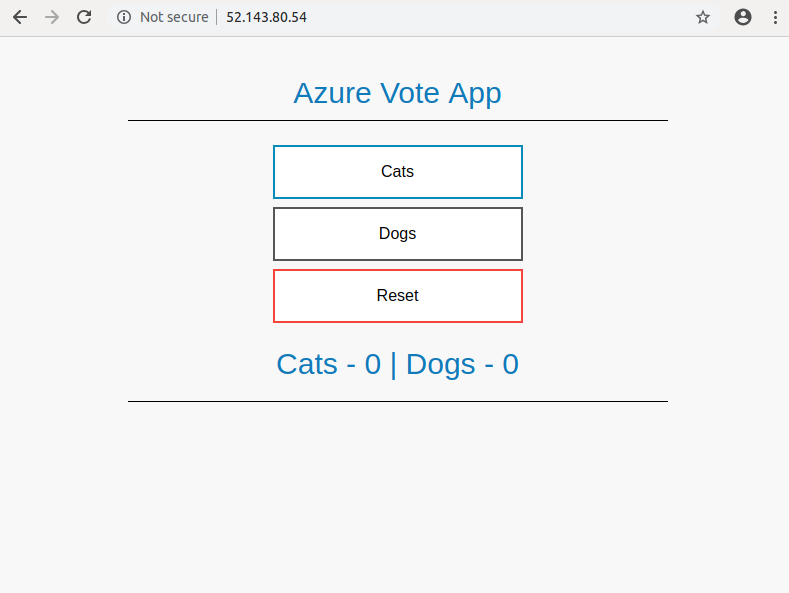

The following challenges are part of a workflow to understand and deploy an application on Kubernetes using a Bedrock workflow. In this case, we will deploy the [Azure voting app](https://github.com/Azure-Samples/azure-voting-app-redis).


To-do: include overall diagram of the system

### Challenge 0: Setup Tools/Artifacts
Objective: Setup for the hack project

Steps:
1. Download and setup the required tools. Follow [these steps](https://github.com/edaena/bedrock-wsl).
2. Create an Azure DevOps project called `voting-app-project`
3. Inside the `voting-app-project` create three repositories: `voting-app`, `voting-hld`, `voting-manifest`
4. In Azure DevOps, generate a Personal Access Token(PAT) with this permissions:
- Build (Read & execute)
- Code (Read, write, & manage)
- Variable Groups (Read, create, & manage)

For help setting up the PAT, see 
[guide](https://docs.microsoft.com/en-us/azure/devops/organizations/accounts/use-personal-access-tokens-to-authenticate?view=azure-devops&tabs=preview-page).

To-do: include diagram of artifacts (repos)

### Challenge 1: GitOps and AKS
Objective: Understand GitOps. Refer to [A first Workload with Bedrock](https://github.com/microsoft/bedrock/tree/docs_spk/docs/firstWorkload).

Goals:
- Deploy a Bedrock single-key vault cluster
- Deploy the Azure voting app resource manifest

Steps:
- Deploy a kubernetes single key-vault cluster with flux via `spk`
- Clone the `voting-manifest` repo that was created in the previous challenge
- Push the `azure-vote.yaml`(resource manifest file) for the voting app in the `voting-manifest` repository.

Azure voting app resource manifest:
```
apiVersion: apps/v1
kind: Deployment
metadata:
  name: azure-vote-back
spec:
  replicas: 1
  selector:
    matchLabels:
      app: azure-vote-back
  template:
    metadata:
      labels:
        app: azure-vote-back
    spec:
      nodeSelector:
        "beta.kubernetes.io/os": linux
      containers:
      - name: azure-vote-back
        image: edsa14/redis:v1
        resources:
          requests:
            cpu: 100m
            memory: 128Mi
          limits:
            cpu: 250m
            memory: 256Mi
        ports:
        - containerPort: 6379
          name: redis
---
apiVersion: v1
kind: Service
metadata:
  name: azure-vote-back
spec:
  ports:
  - port: 6379
  selector:
    app: azure-vote-back
---
apiVersion: apps/v1
kind: Deployment
metadata:
  name: azure-vote-front
spec:
  replicas: 1
  selector:
    matchLabels:
      app: azure-vote-front
  template:
    metadata:
      labels:
        app: azure-vote-front
    spec:
      nodeSelector:
        "beta.kubernetes.io/os": linux
      containers:
      - name: azure-vote-front
        image: edsa14/azure-vote-front:v1
        resources:
          requests:
            cpu: 100m
            memory: 128Mi
          limits:
            cpu: 250m
            memory: 256Mi
        ports:
        - containerPort: 80
        env:
        - name: REDIS
          value: "azure-vote-back"
---
apiVersion: v1
kind: Service
metadata:
  name: azure-vote-front
spec:
  type: LoadBalancer
  ports:
  - port: 80
  selector:
    app: azure-vote-front
```

### Challenge 1.1: Resource Manifest
Objective: Understand the pros and cons of working with raw resource manifests

Goal: Make a change to the voting app resource manifest. Verify it was automatically deployed via GitOps.

Steps:
- Change the docker image tag for the voting app from `v1` to `v3` in the `azure-vote.yaml`. New image name: `edsa14/azure-vote-front:v2`
- Push the change to the repository

The v3 application should have the title in blue:



### Challenge 1.2: Helm (optional)
Objective: Generate a resource manifest from a helm chart

Goal: Get a basic understanding of the pros/cons of Helm.

Steps:
- Clone the [repository](https://github.com/edaena/helm-charts) with the helm chart for the azure voting app. 
- `cd helm-charts`
- `helm template ./azure-vote`
- Change the image tag in `values.yaml` to `v3`
- `helm template ./azure-vote`

Verify that the generated resource manifest has the `v2` image tag.

### Challenge 1.3: From Helm to High Level Deployment Definitions
Objective: Generate resource manifests for different environments from an HLD.

Goal: Understand the benefits of using HLDs for large applications for different deployment environments.

Steps:
- Clone the [Azure voting app HLD repository](https://github.com/edaena/azure-vote-hld)
- `fab install`
- `fab generate common`
- `fab generate prod`

Compare the `common` and `prod` manifests.

### Challenge 2: HLD to resource manifests DevOps
Objective: Automate generating resource manifests from HLDs.

Goal: Set up the `hld -> manifests` pipeline via `spk`

Relevant commands:
- `spk hld init`
- `spk hld install-manifest-pipeline`

### Challenge 3: App to HLD and ACR DevOps
Objective: Automate generating HLDs from an application repository

Goal: Set up a Bedrock project with the `app -> hld` pipeline and the `app -> acr` pipeline

Setup:
- Create an azure storage account

Relevant commands:
- `spk project init`
- `spk project create-variable-group`
- Run `bash /scripts/setup.sh create` (Creates a resource group, storage account, table, and adds variables to variable group)
- `spk project install-lifecycle-pipeline`

### Challenge 4: Make a revision
Objective: Make a change to the voting application and create a revision with spk

Relevant commands:
- `spk service create-revision`

### Challenge 5: Introspection
Objective: View information about the application deployment and GitOps workflow.

Steps:
- Get the `introspection` values using `bash /scripts/setup.sh values`
- Add the required `introspection` configuration values in `spk-config.yaml`
```
introspection:
  dashboard:
    image: "samiyaakhtar/spektate:prod" # Use this default docker image unless you would like to use a custom one
    name: "spektate"
  azure: # This is the storage account for the service introspection tool.
    account_name: "<your-alias>" # Must be defined to run spk deployment commands
    table_name: "storage-account-table-name" # Must be defined to run spk deployment commands
    partition_key: "storage-account-table-partition-key" # Must be defined to run spk deployment commands
    key: "storage-access-key" # Must be defined to run spk deployment commands. Use ${env:INTROSPECTION_STORAGE_ACCESS_KEY} and set it in .env file
```

Relevant commands:
- `spk init`
- `spk deployment get`
- `spk-deployment dashboard`

To-do: Add image of the dashboard


### Challenge 6: Observability

### Challenge 7: Deploying cluster in multiple regions

### Challenge 8: Rings
